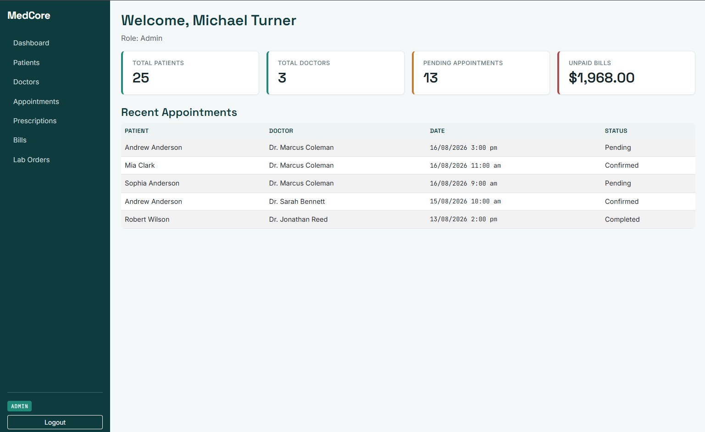
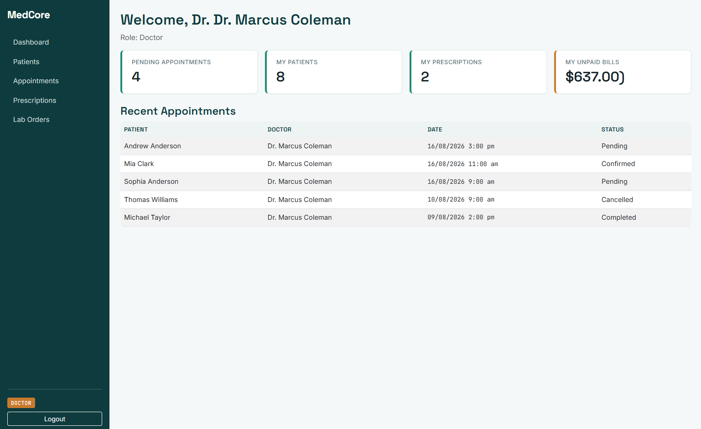
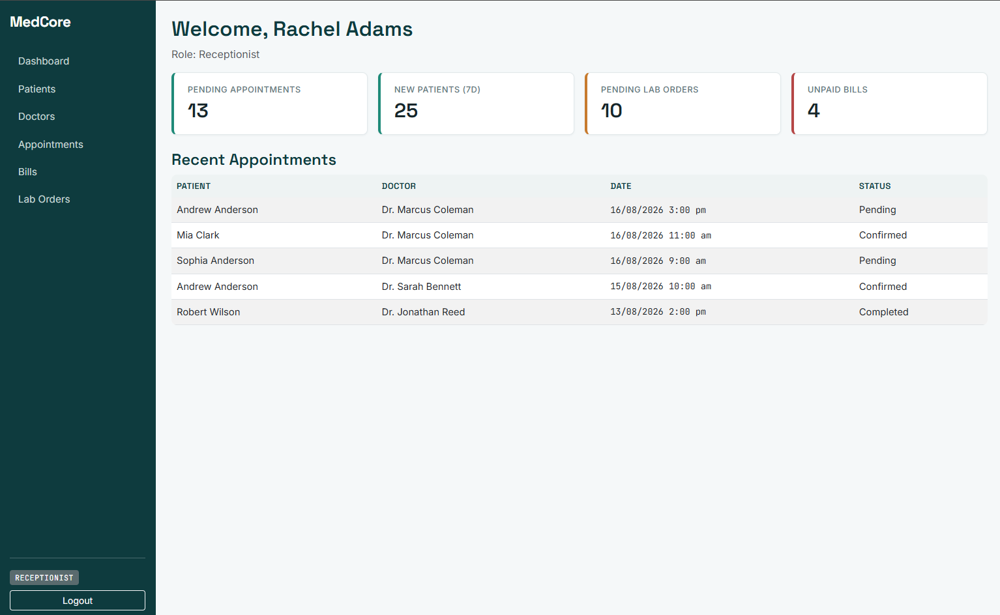
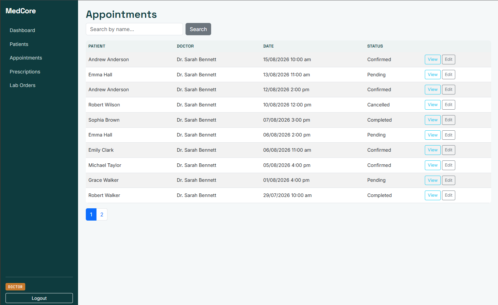
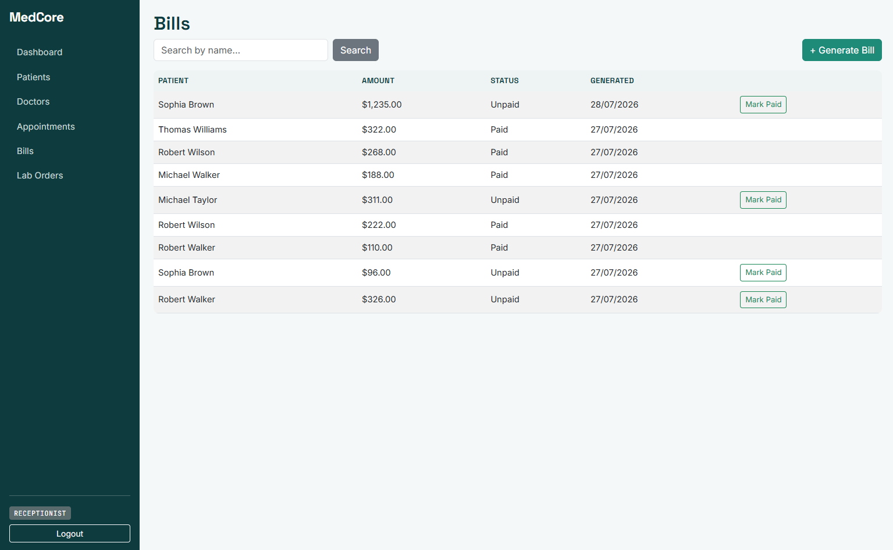
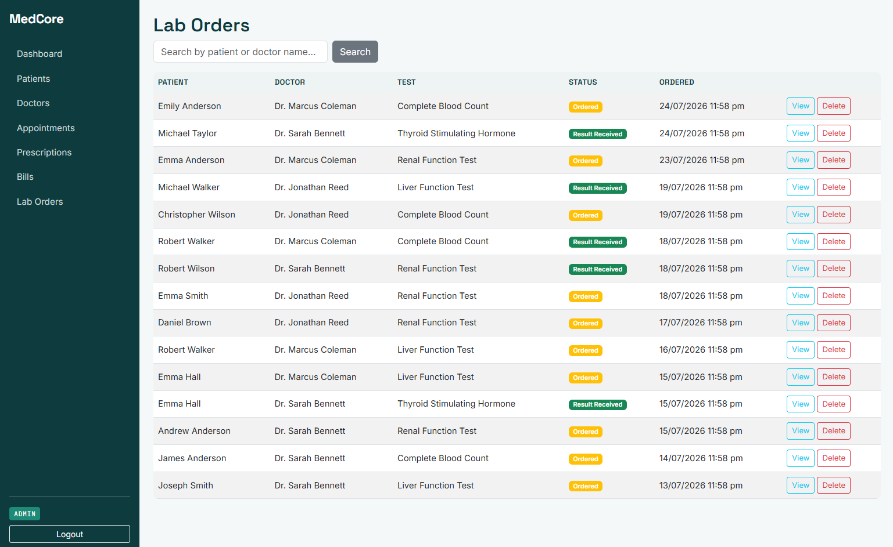
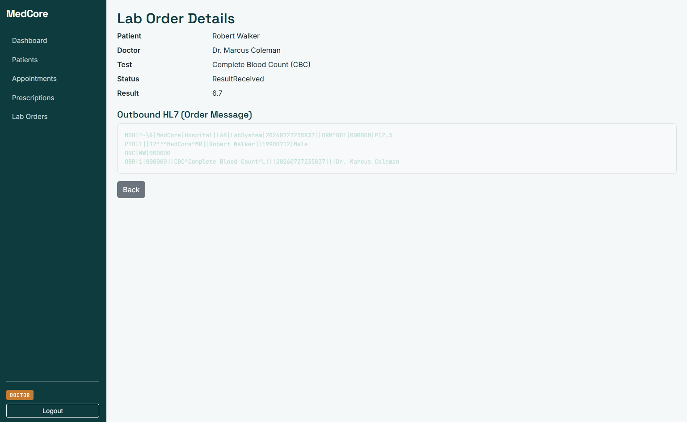
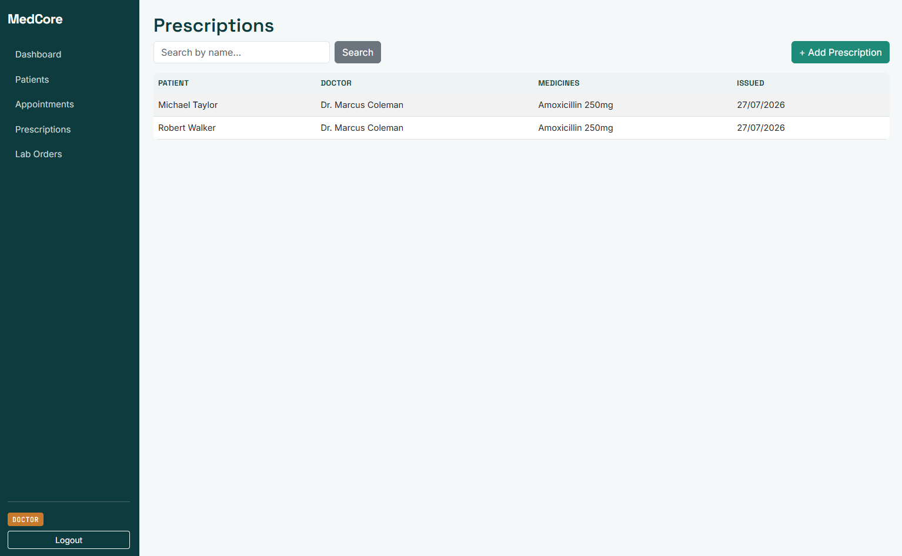

# MedCore — Clinic Management System

A multi-role Clinic Management System built with ASP.NET Core MVC, demonstrating enterprise software patterns relevant to healthcare domain applications — including HL7 messaging, role-scoped data access, and clinical workflow logic.

## Tech Stack

- ASP.NET Core MVC (.NET 8)
- Entity Framework Core + SQL Server
- ASP.NET Core Identity (role-based authentication: Admin, Doctor, Receptionist)
- Bootstrap 5 with a custom clinical design system (Space Grotesk / Inter / JetBrains Mono)

## Features

### Authentication & Authorization
- ASP.NET Identity with role-based access control enforced at the controller level (not just hidden UI)
- Self-service doctor registration with auto-linked profiles — a new doctor account is automatically tied to its `Doctor` record on signup, no manual admin linking step required

### Core Modules
- **Patient Management** — registration, search, pagination
- **Doctor Management** — department assignment, specialization, linked login account
- **Appointment Scheduling** — conflict detection prevents double-booking a doctor at the same time slot
- **Prescriptions** — tied to completed appointments via a one-to-one relationship
- **Billing** — tied to completed appointments, unpaid/paid status tracking, USD-formatted regardless of server locale
- **Lab Orders** — order tests, generate and parse simulated HL7 order/result messages, track order status (Ordered / Result Received)
- **FHIR-Style API** — read-only REST endpoints (`/fhir/Patient/{id}`, `/fhir/Appointment/{id}`) that expose internal data shaped as FHIR `Patient` and `Appointment` resources, for interoperability with external healthcare systems

### Role-Based Dashboards
Each role sees stats relevant to their day-to-day work instead of one generic view:
- **Admin** — total patients, total doctors, pending appointments (all doctors), unpaid bills total
- **Doctor** — own patient count, own prescriptions written, own pending appointments, own unpaid bills
- **Receptionist** — pending appointments, new patients this week, pending lab orders, unpaid bills count

### Role-Scoped Data Access
Beyond page-level authorization, data itself is scoped per doctor across the app:
- Doctors only see their own patients, appointments, prescriptions, bills, and lab orders — never another doctor's data
- Dropdowns (e.g. ordering a lab test) only list a doctor's own patients, with the ordering doctor auto-selected and locked (not user-editable) to prevent submitting orders under another doctor's name

### Data Integrity & UX
- Referential integrity enforced at the database level (restricted deletes on records with dependent data), with friendly error handling instead of raw exceptions
- Search and pagination across all major data tables
- Auto-formatted names on save (consistent capitalization regardless of input casing)

## Architecture

- **ViewModels** separate form input from EF entities (validation lives here, not on domain models)
- **Explicit relationship configuration** in `ApplicationDbContext` for ambiguous one-to-one relationships (Appointment↔Prescription, Appointment↔Bill, Doctor↔ApplicationUser)
- **DeleteBehavior.Restrict** on Doctor/Patient foreign keys — protects appointment history from silent data loss
- **HL7 message helper** (`Hl7Helper`) generates and parses simplified HL7-formatted order and result messages for the Lab Orders module
- **Role seeding + demo data seeding** on startup — creates all three roles, sample departments, patients, and working login accounts (admin, doctors, receptionists) with fully linked, realistic relational data for immediate exploration

## Setup

1. Clone the repo
2. Update the connection string in `appsettings.json` if your SQL Server instance differs
3. Run migrations:
   ```
   dotnet ef database update
   ```
4. Run the app:
   ```
   dotnet run
   ```
5. Log in with seeded demo accounts, or register your own:
   - Admin — `admin@medcore.com` / `Staff@123`
   - Doctor — `dr.reed@medcore.com` / `Doctor@123`
   - Receptionist — `reception1@medcore.com` / `Staff@123`

## Screenshots

### Admin Dashboard


### Doctor Dashboard


### Receptionist Dashboard


### Appointments List


### Bills List


### Lab Orders List


### Lab Order with HL7 Message


### Prescriptions List


## Why these design choices

This project was built to demonstrate transferable software engineering fundamentals — clean architecture, proper authorization boundaries, and real business logic (conflict detection, referential integrity, role-scoped data access) — using an enterprise stack (C#, ASP.NET Core, SQL Server) relevant to healthcare software teams. The Lab Orders module (HL7 messaging) and the FHIR-shaped API layer specifically demonstrate familiarity with healthcare interoperability standards used in real EHR/clinic systems.